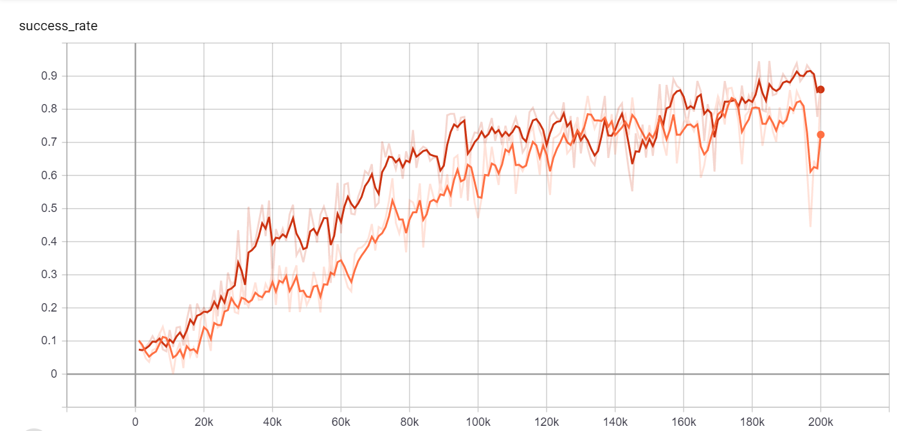

The goal of this experiment is to compare the types of teachers. The success rate of this experiment is shown below. The red curve is the success rate of the agent trained by a knowledgable teacher and a discouraging teacher, and the orange curve is the agent trained by a optimistic teacher and a discouraging teacher.

