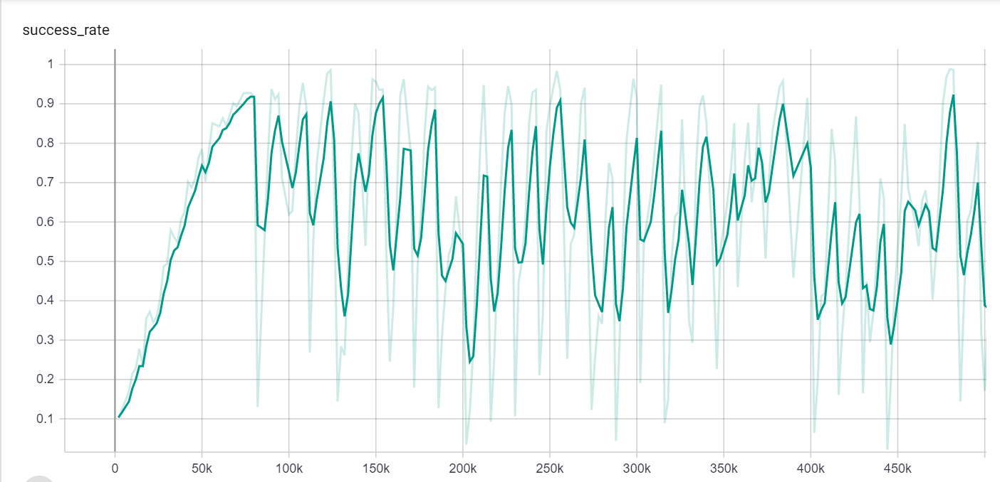

This experiment trains the agent on the same board first. Next, the agent is trained on different boards for a fixed amount of time before changing the board. However, the agent does not work well on a board without quickly learning it first. The success rate of this experiment is shown below.

