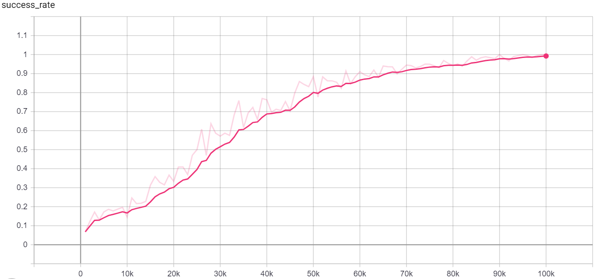

This experiment trains the agent while fixing the board and the starting position. Moreover, this experiment has a special reward function that allows the goals "Avoid any lava" and "Avoid any goal" to be learned. The success rate of this experiment is shown below.

