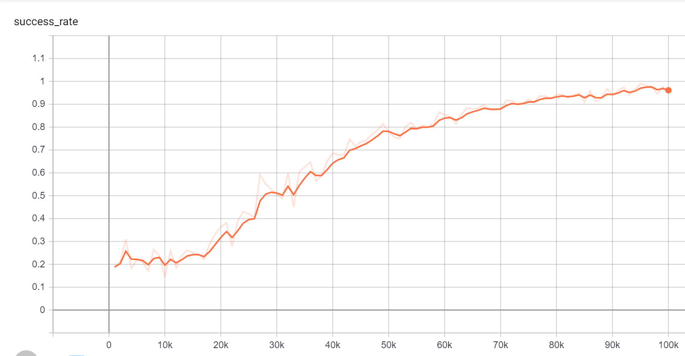
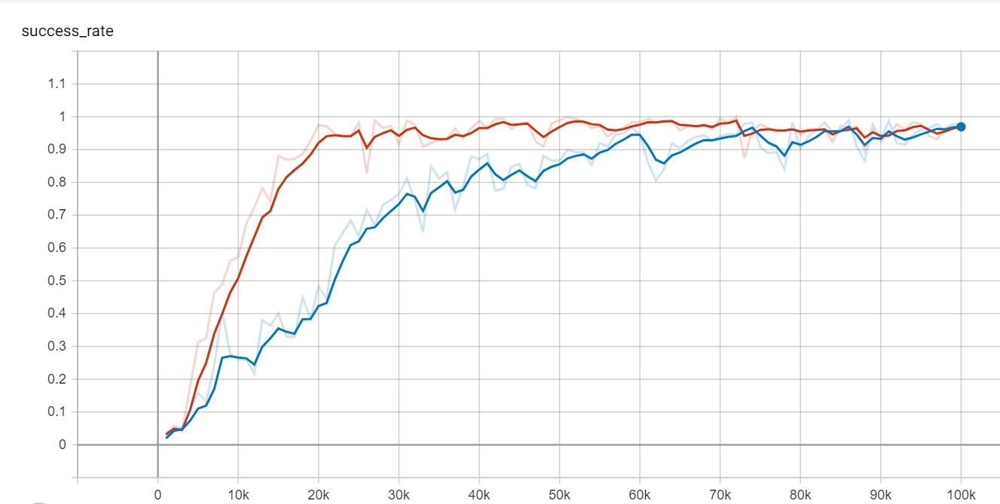

The goal of this experiment is to verify that a network pretrained with pessimistic teachers will learn much faster compared to a network that is not pretrained. The success rate of this experiment is shown below. The graph belows shows the success rate of the pretrained network on undesirable goals when the network is traiend by the pessimistic teachers. 

The graph below shows the success rate of the networks training on desired goals with a optimistic and a discouraging teacher. The red curve is the success rate of the pretrained network, and the blue curve is the success rate of the netowrk that is not pretrained. 

